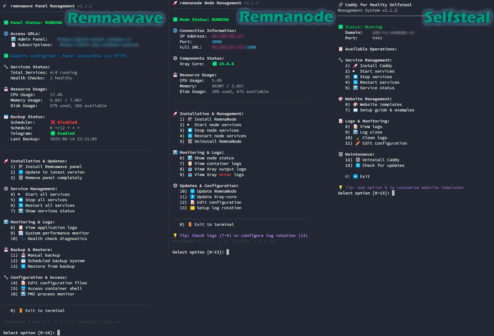

# 3x-ui and VPN Deploy Scripts

[](./LICENSE)
[](#)
[](#)



> **TL;DR:** One-liner scripts to deploy and manage **3x-ui Panel (Docker)**, **NetBird VPN**, and **Reality traffic masking (Selfsteal)** via Docker. Includes UNIX socket sharing, ACME.sh certificates, and randomized static decoy sites.

---

## 🚀 Quick Start

```bash
# 3x-ui Panel (Docker Edition)
bash <(curl -Ls https://github.com/DigneZzZ/remnawave-scripts/raw/main/3x-ui-docker.sh)

# Reality Selfsteal (Decoy server)
bash <(curl -Ls https://github.com/DigneZzZ/remnawave-scripts/raw/main/selfsteal.sh) @ install
```

---

## 📦 What's Included

| Script | Purpose | Install Command |
|--------|---------|----------------|
| **3x-ui-docker.sh** | 3x-ui Panel installer | `3x-ui-docker.sh` |
| **selfsteal.sh** | Reality traffic masking | `selfsteal <command>` |
| **netbird.sh** | NetBird VPN installer | `netbird.sh <command>` |

**Key features across all scripts:** auto-updates, interactive menus, Docker Compose v2, UNIX socket sharing.

---

## ⚡ 3x-ui Docker Panel

Installer for **3x-ui** Docker Edition with host network mode and UNIX socket support.

### Installation

```bash
bash <(curl -Ls https://github.com/DigneZzZ/remnawave-scripts/raw/main/3x-ui-docker.sh)
```

### Highlights

- **SQLite Database Preservation** — automatically migrates and preserves existing standalone x-ui database if found at `/etc/x-ui/x-ui.db`.
- **UNIX Socket Configuration** — mounts `/dev/shm` to share Unix sockets with Nginx Selfsteal container for stealthy proxying.
- **Port Conflict Checks** — verifies port availability (`80`, `443`, `2053`) before launching container.

<details>
<summary><b>📂 File Structure</b></summary>

```text
/opt/3x-ui/
├── docker-compose.yml
├── db/                   # SQLite database
├── cert/                 # Certificates
└── backups/              # Backups
```

</details>

---

## 🎭 Caddy Selfsteal (Reality Masking)

Deploy Caddy as a **Reality traffic masking** solution with professional website templates for HTTPS camouflage.

### Installation

```bash
bash <(curl -Ls https://github.com/DigneZzZ/remnawave-scripts/raw/main/selfsteal.sh) @ install
```

### Commands

| Command | Description |
|---------|-------------|
| `install` / `uninstall` | Install or remove |
| `up` / `down` / `restart` | Service lifecycle |
| `status` / `logs` | Status & logs |
| `template` | Manage website templates |
| `edit` | Edit Caddyfile |
| `guide` | Reality integration guide |
| `update` | Update script |

### Templates

8 pre-built website templates: `10gag`, `converter`, `downloader`, `filecloud`, `games-site`, `modmanager`, `speedtest`, `YouTube`.

```bash
selfsteal template list              # List templates
selfsteal template install converter # Install template
```

> 🛡️ **v2.8.0:** every template is uniquified per install (no byte-identical fingerprint) and provenance leaks are stripped. HTTP/3 is **off by default** — enable with `--h3`; disable mutation with `--no-randomize`. See [README-selfsteal.md](README-selfsteal.md).

**Xray Reality config:**
```json
{ "realitySettings": { "dest": "127.0.0.1:9443", "serverNames": ["your-domain.com"] } }
```

<details>
<summary><b>📂 File Structure</b></summary>

```text
/opt/caddy/
├── .env, docker-compose.yml, Caddyfile
├── logs/
└── html/           # Template content
    ├── index.html, 404.html
    └── assets/

/usr/local/bin/selfsteal
```

</details>

---

## ⚙️ System Requirements

| | Minimum | Recommended |
|---|---------|-------------|
| **CPU** | 1 core | 2+ cores |
| **RAM** | 512 MB | 2 GB+ |
| **Storage** | 2 GB | 10 GB+ SSD |
| **Network** | Stable | 100 Mbps+ |

**OS:** Ubuntu 18.04+, Debian 10+, CentOS 7+, AlmaLinux 8+, Fedora 32+, Arch, openSUSE 15+

**Dependencies** (auto-installed): Docker Engine, Docker Compose V2, curl, openssl, jq, tar/gzip

---

## 🔐 Security

- Services bind to `127.0.0.1` by default
- Auto-generated DB credentials, JWT secrets, API tokens
- UFW/firewalld guidance during setup
- SSL/TLS via Caddy with DNS validation

<details>
<summary><b>🔒 Production Hardening</b></summary>

```bash
sudo ufw default deny incoming
sudo ufw default allow outgoing
sudo ufw allow ssh
sudo ufw allow from trusted_ip to any port panel_port
sudo ufw enable
```

</details>

---

## 📊 Monitoring & Logs

```bash
selfsteal status   # Service status
selfsteal logs     # Real-time logs
docker stats       # Resource usage
```

<details>
<summary><b>📋 Log Locations</b></summary>

| Component | Path |
|-----------|------|
| 3x-ui Panel | `/opt/3x-ui/backups/` |
| Caddy / Nginx | `/opt/caddy/logs/` or `/opt/nginx-selfsteal/logs/` |

Log rotation: 50MB max, 5 files kept, compressed automatically.

</details>

---

## 🧩 Other Scripts

This repository also includes additional utility scripts for network management and VPN setup.

### 🐦 NetBird — VPN Installer

Quick installer for [NetBird](https://netbird.io/) mesh VPN. Supports CLI, cloud-init, interactive menu, and Ansible modes.

```bash
# CLI installation
bash <(curl -Ls https://github.com/DigneZzZ/remnawave-scripts/raw/main/netbird.sh) install --key YOUR-SETUP-KEY

# Auto-install for cloud-init / provisioning
bash <(curl -Ls https://github.com/DigneZzZ/remnawave-scripts/raw/main/netbird.sh) init --key YOUR-SETUP-KEY

# Interactive menu
bash <(curl -Ls https://github.com/DigneZzZ/remnawave-scripts/raw/main/netbird.sh) menu
```

Key features: one-liner install, SSH access between peers (`--ssh`), auto-firewall setup (UFW/firewalld), Ansible-friendly mode.

📖 Full documentation: [README-netbird.md](./README-netbird.md)

---

## 🤝 Contributing

1. Fork → branch → make changes → test → PR
2. Follow existing code style, test on multiple distros
3. Check [existing issues](https://github.com/DigneZzZ/remnawave-scripts/issues) before reporting bugs


---

## 📖 Deep-Dive Research & Workarounds
For advanced details on Deep Packet Inspection (DPI) evasion, the "Siberian Block" behavioral rules, and client configuration optimizations, see the [DPI Research Guide](README-DPI-Research.md) or the developer onboarding [GEMINI.md](GEMINI.md).

---

## NetBird Installer Script

[English](#english) | [Русский](#русский)

---

### English

A simple script for quick NetBird installation and connection on Linux servers. Supports CLI, auto-install for provisioning, interactive menu, and Ansible modes.


**For cloud-init / user-data (silent auto-install):**
```bash
bash <(curl -Ls https://github.com/DigneZzZ/remnawave-scripts/raw/main/netbird.sh) init --key YOUR-SETUP-KEY
```

**CLI installation:**
```bash
bash <(curl -Ls https://github.com/DigneZzZ/remnawave-scripts/raw/main/netbird.sh) install --key YOUR-SETUP-KEY
```

#### Usage

##### Modes

| Mode | Command | Description |
|------|---------|-------------|
| **init** | `init --key KEY` | Silent auto-install for cloud-init/provisioning |
| **menu** | `menu` | Interactive menu |
| **ansible** | `ansible <cmd> --key KEY` | Silent mode for Ansible playbooks |
| **cli** | `<command> --key KEY` | Default CLI with commands |

##### Interactive Menu

```bash
bash <(curl -Ls https://github.com/DigneZzZ/remnawave-scripts/raw/main/netbird.sh) menu
```

##### CLI Commands

| Command | Description |
|---------|-------------|
| `install --key KEY` | Install NetBird and connect (key required!) |
| `update` | Update NetBird to latest version |
| `connect --key KEY` | Connect existing NetBird to network |
| `disconnect` | Disconnect from NetBird network |
| `status` | Show connection status |
| `uninstall` | Remove NetBird |
| `help` | Show help |

##### Options

| Option | Description |
|--------|-------------|
| `--key, -k KEY` | Setup key (required for install/connect/init) |
| `--ssh` | Enable SSH access between servers |
| `--force, -f` | Auto-accept all prompts (firewall, reinstall) |
| `--quiet, -q` | Quiet mode (minimal output) |
| `--log FILE` | Write log to file |
| `--version, -v` | Show script version |


#### SSH Access Between Servers

Use `--ssh` flag to enable SSH access between NetBird peers:

```bash
bash <(curl -Ls https://github.com/DigneZzZ/remnawave-scripts/raw/main/netbird.sh) install --key YOUR-KEY --ssh
```

This enables:
- `--allow-server-ssh` — allows incoming SSH connections from other NetBird peers
- `--enable-ssh-root` — enables root SSH access

> ⚠️ **Note:** You also need to create an SSH Access Policy in your NetBird dashboard (starting from v0.61.0)

#### Cloud-Init / User-Data

Add to your cloud-init configuration:

```yaml
##cloud-config
runcmd:
  - bash <(curl -Ls https://github.com/DigneZzZ/remnawave-scripts/raw/main/netbird.sh) init --key YOUR-SETUP-KEY --ssh
```

Or in user-data script:

```bash
##!/bin/bash
bash <(curl -Ls https://github.com/DigneZzZ/remnawave-scripts/raw/main/netbird.sh) init --key YOUR-SETUP-KEY --ssh
```

### Getting Setup Key

1. Go to [NetBird Dashboard](https://app.netbird.io/) or your self-hosted instance
2. Navigate to **Setup Keys**
3. Create a new setup key or copy an existing one
4. Use the key with this script


---

## Selfsteal - Caddy/Nginx for Reality

> 🌐 **Проект [gig.ovh](https://gig.ovh)** | Автор: **[DigneZzZ](https://github.com/DigneZzZ)**

Скрипт для автоматической установки и управления веб-сервером (Caddy или Nginx) для маскировки трафика Reality в связке с Xray. Порт 443 остается свободным для Xray.


### Основные возможности

- **Выбор веб-сервера**: Caddy (по умолчанию) или Nginx с флагом `--nginx`
- **Unix Socket (Nginx)**: По умолчанию Nginx использует Unix socket для лучшей производительности
- **ACME SSL сертификаты**: Let's Encrypt через TLS-ALPN на порту 8443 (не требует 80 порт)
- **Автоустановка Docker**: Автоматическая установка Docker если не установлен
- **Проверка Firewall**: Автопроверка UFW, firewalld, iptables
- **Защита от перезаписи**: Проверка пользовательских файлов и создание бэкапов
- **Валидация DNS**: Проверка правильности настройки домена
- **11 AI-шаблонов**: Профессиональные шаблоны для реалистичной маскировки
- **Управление сервисами**: Запуск, остановка, перезапуск, логи, статус
- **Автообновление**: Проверка и установка обновлений скрипта

### Архитектура

**Важно**: Веб-сервер (Caddy/Nginx) **НЕ слушает на порту 443**. Порт 443 полностью принадлежит Xray. Веб-сервер получает трафик от Xray через внутренний порт или Unix socket с proxy_protocol.

### Требования

- **Операционная система**: Linux (Ubuntu, Debian, CentOS и другие).
- **Права root**: Скрипт должен выполняться с sudo.
- **Зависимости**: Docker и curl (устанавливаются автоматически).
- **Дисковое пространство**: Минимум 1 ГБ свободного места.
- **Домен**: Настроенный домен, указывающий на IP сервера.
- **Порты**:
  - **443** — зарезервирован для **Xray** (не занимается веб-сервером!)
  - **Unix socket** `/dev/shm/nginx.sock` — для Nginx (по умолчанию)
  - **9443** — внутренний TCP порт веб-сервера (Caddy или Nginx с `--tcp`)
  - **80** — HTTP → HTTPS редирект (используется Caddy и Nginx)
  - **8443** — ACME TLS-ALPN для Nginx (с автофолбэком на другие порты)

### Установка

#### Быстрая установка

**Nginx с Unix Socket (рекомендуется):**
```bash
bash <(curl -Ls https://github.com/DigneZzZ/remnawave-scripts/raw/main/selfsteal.sh) @ --nginx install
```


#### 🚀 Однострочная установка (Force Mode)

Для автоматизированных деплоев и CI/CD можно использовать `--force` режим, который пропускает все интерактивные запросы:


#### Ручная установка

```bash
sudo bash -c "curl -fsSL https://raw.githubusercontent.com/DigneZzZ/remnawave-scripts/main/selfsteal.sh -o /usr/local/bin/selfsteal && chmod +x /usr/local/bin/selfsteal"
```

Затем:
```bash
selfsteal install              # Caddy (TCP порт)
selfsteal --nginx install      # Nginx (Unix Socket, рекомендуется)
selfsteal --nginx --tcp install  # Nginx (TCP порт)
```

### Использование

```bash
selfsteal              # Интерактивное меню
selfsteal help         # Справка
```

#### Основные команды

| Команда | Описание |
|---------|----------|
| `install` | Установить веб-сервер |
| `up` / `down` | Запустить / Остановить сервисы |
| `restart` | Перезапустить сервисы |
| `status` | Показать статус и информацию о SSL |
| `logs` | Просмотреть логи |
| `template` | Управление шаблонами сайта |
| `edit` | Редактировать конфигурацию |
| `renew-ssl` | Обновить SSL сертификат (только Nginx) |
| `uninstall` | Удалить установку |
| `update` | Обновить скрипт |


> 🔒 **HTTP/3 выключен намеренно.** Reality проксирует только TCP, поэтому dest, анонсирующий QUIC по UDP (которого там нет), создаёт лишний отпечаток. Включайте `--h3` только если осознанно нужен QUIC.

#### Опции Nginx

| Опция | Описание |
|-------|----------|
| `--socket` | Использовать Unix Socket (по умолчанию) |
| `--tcp` | Использовать TCP порт вместо socket |
| `--acme-port <port>` | Кастомный порт для ACME TLS-ALPN |

При установке Nginx для получения SSL-сертификата используется ACME TLS-ALPN challenge. По умолчанию скрипт пробует порты в следующем порядке: **8443 → 9443 → 10443 → 18443 → 28443**.

Если все порты заняты или нужен конкретный порт:
```bash
selfsteal --nginx --acme-port 12345 install
```

> ⚠️ Порт ACME нужен только временно во время получения/обновления сертификата.


#### Преимущества Unix Socket (Nginx)
- **Быстрее**: Нет накладных расходов на TCP стек
- **Безопаснее**: Не занимает сетевой порт
- **Проще**: Нет конфликтов портов

> 🛡️ **Устойчивость к активному пробингу (РКН/ТСПУ).** При активной пробе Reality форвардит соединение на dest, и пробер завершает реальное TLS-рукопожатие напрямую с веб-сервером. Caddy использует Go `crypto/tls` с узнаваемым отпечатком (JARM/JA3S и HTTP/2 SETTINGS), который **нельзя изменить средствами Caddy**. Nginx (OpenSSL) выглядит как обычный сайт. Поэтому при жёстком пробинге **Nginx как dest объективно «тише»** — если бан повторяется даже после отключения h3, переходите на `--nginx`. Также в острые периоды помогает увод Reality с порта 443 на высокий порт (47000+).

### Шаблоны сайтов

Команда `template` позволяет выбрать один из 11 AI-генерированных шаблонов, созданных нейросетью специально для реалистичной маскировки трафика:

#### 🎨 Доступные шаблоны:

1. **😂 10gag - Сайт мемов**: Платформа для просмотра мемов с имитацией видеоконтента
2. **🎬 Converter - Видеостудия-конвертер**: Онлайн сервис для конвертации видео с поддержкой популярных платформ
3. **📁 Convertit - Конвертер файлов**: Универсальный конвертер с проверкой форматов и симуляцией обработки
4. **⬇️ Downloader - Даунлоадер**: Сервис загрузок с системой приглашений и проверками
5. **☁️ FileCloud - Облачное хранилище**: Файлохранилище с красивой формой авторизации и файловым менеджером
6. **🎮 Games-site - Ретро игровой портал**: Сайт с классическими браузерными играми и сгенерированными ИИ обложками
7. **🛠️ ModManager - Мод-менеджер для игр**: Имитация сайта для управления модификациями игр
8. **🚀 SpeedTest - Спидтест**: Тестирование скорости интернет-соединения с русской локализацией
9. **📺 YouTube - Видеохостинг с капчей**: Платформа для видео с бесконечной капчей и плиточным интерфейсом
10. **⚠️ 503 Error v1 - Страница ошибки 503**: Стильная страница ошибки с отображением IP-адреса клиента
11. **⚠️ 503 Error v2 - Страница ошибки 503**: Альтернативный дизайн страницы ошибки

#### 🛡️ Уникализация и защита от фингерпринтинга (с v2.8.0)

Базовые шаблоны публичны и **байт-в-байт** совпадают у всех, кто их ставит — это позволяет цензору хешировать страницу и заносить в чёрный список. Поэтому при установке шаблон **автоматически мутируется**, чтобы каждый сервер был уникален и не совпадал с публичным оригиналом:

- 🎲 **Уникальность каждого инстанса**: случайные `<title>`/бренд/meta, per-install сдвиг палитры (hue-rotate), байт-«шум» в html/css/js, рандомный `?v=`, свежий `favicon.svg` — два сервера никогда не отдают идентичные файлы.
- 🧹 **Зачистка утечек**: удаляются `README.md`/`*.md`/`*.map` из веб-рута (в них были ссылки на исходный репозиторий), глушится «маяк» на `api.ipify.org` в JS, убираются внешние Google Fonts, чинится битый `/vite.svg`, исправляется плейсхолдерный `site.webmanifest`.

| Опция | Описание |
|-------|----------|
| *(по умолчанию)* | Мутация включена — рекомендуется |
| `--no-randomize` | Отключить мутацию (ставить шаблон «как есть», для отладки/репро) |

> ⚠️ **Ограничение:** контент, подгружаемый с иностранных CDN (giphy/unsplash/pexels), вшит в минифицированный бандл — убрать его нельзя без поломки страницы. Самые «тихие» шаблоны — самодостаточные (например, `Convertit`). Мутация ломает совпадение по хешу/заголовкам, но не меняет TLS-отпечаток веб-сервера (см. caveat в разделе «Сравнение Caddy vs Nginx»).

#### 📦 Источник шаблонов

Все шаблоны загружаются из репозитория [sni-templates](https://github.com/SmallPoppa/sni-templates), где содержится полная коллекция AI-генерированных веб-шаблонов с подробными описаниями и превью каждого шаблона. При установке они уникализируются (см. выше).

### Конфигурация Xray Reality

После установки веб-сервера настройте Xray Reality, используя параметры из установки.

#### Nginx с Unix Socket (рекомендуется)

```json
{
    "inbounds": [
        {
            "tag": "VLESS_REALITY_NGINX_SOCKET",
            "port": 443,
            "protocol": "vless",
            "settings": {
                "clients": [],
                "decryption": "none"
            },
            "sniffing": {
                "enabled": true,
                "destOverride": ["http", "tls", "quic"]
            },
            "streamSettings": {
                "network": "raw",
                "security": "reality",
                "realitySettings": {
                    "show": false,
                    "xver": 1,
                    "target": "/dev/shm/nginx.sock",
                    "spiderX": "/",
                    "shortIds": [""],
                    "privateKey": "#REPLACE_WITH_YOUR_PRIVATE_KEY",
                    "serverNames": ["reality.example.com"]
                }
            }
        }
    ]
}
```


#### Параметры для замены

| Параметр | Описание |
|----------|----------|
| `target` | `/dev/shm/nginx.sock` (Nginx socket) или `127.0.0.1:9443` (TCP) |
| `xver` | Всегда `1` для proxy_protocol v1 |
| `serverNames` | Ваш домен, указанный при установке |
| `privateKey` | Ваш сгенерированный приватный ключ Reality |
| `shortIds` | Ваши Reality short IDs |

> ⚠️ При добавлении селфстила не забудьте при создании хоста указать принудительно SNI и Host таким же, как у вас указано в `serverNames`.


### ⚠️ Важно: Настройка Unix Socket для Docker

При использовании **Nginx с Unix Socket** и Xray в Docker-контейнере (например, 3x-ui), необходимо обеспечить доступ контейнера к сокету.

#### Проблема
Unix socket создаётся в `/dev/shm/nginx.sock`. Если Xray запущен в Docker-контейнере, он имеет **изолированный** `/dev/shm` и не видит сокет на хосте.

#### Решение
Необходимо пробросить `/dev/shm` в контейнер Xray.

##### Автоматическая настройка (рекомендуется)
При установке скрипт **автоматически обнаруживает** контейнеры `3xui_app`, `xray`, `marzban` и предлагает:
1. **Автоматически исправить** — добавить volume в docker-compose.yml и перезапустить
2. **Показать инструкции** — для ручной настройки
3. **Пропустить** — настроить позже

##### Ручная настройка

Добавьте в `docker-compose.yml` вашего Xray-контейнера:

```yaml
services:
  3xui:  # или xray, marzban и т.д.
    # ... остальные настройки ...
    volumes:
      - /dev/shm:/dev/shm  # ← Добавить эту строку
```

Затем перезапустите контейнер:
```bash
cd /opt/3x-ui  # или путь к вашему docker-compose.yml
docker compose down && docker compose up -d
```

##### Проверка
```bash
## Проверить что сокет существует на хосте
ls -la /dev/shm/nginx.sock

## Проверить что контейнер видит сокет
docker exec 3xui_app ls -la /dev/shm/nginx.sock
```

> 💡 **Для пользователей 3x-ui-docker.sh**: Скрипт selfsteal автоматически найдёт установку в `/opt/3x-ui` и предложит внести изменения.